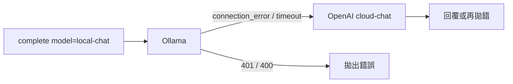

# routing（aicentral v4.0）

> 規格：[aicentral-v4.0.md](./aicentral-v4.0.md) · 程式：`src/aicentral/routing/`

---

## 一句話

Router 負責把呼叫端的 **`model` 字串**（或「沒傳 model」時的預設）解析成 **哪個 provider、哪個 model_id、用哪組 URL／金鑰**，並在設定允許時對 **連線失敗／逾時** 執行 **靜態 fallback**（例如本機 Ollama → 雲端 OpenAI）。

一般使用者只需呼叫 `complete()` / `Chat.complete()`；Router 在內部由 `complete_with_fallback()` 自動使用。

---

## 名稱說明：不是後端 HTTP 接口

「Router」在 aicentral 裡指的是 **函式庫內部的模型／provider 選路**，**不是**：

- 對外開立的 REST API 或「Router 服務」
- Web 框架裡的路由表（例如 `GET /api/chat`）
- 需先連線某台 **Router 伺服器** 再轉發到 LLM 的中間層

消費方在自家程式裡 `import aicentral` 並呼叫 `complete()` 時，Router 在**同一個 process** 內完成解析與 fallback，然後由 `providers/` 用 httpx 直接打 **Ollama / OpenAI / Anthropic / Gemini** 等既有 LLM API。

| 名稱 | 是什麼 | aicentral v4.0 |
|------|--------|----------------|
| **aicentral Router**（本文件） | `model` 字串 → provider、金鑰、fallback | ✅ `routing/router.py` |
| **LLM 供應商 API** | 真正的後端接口（如 `POST .../chat/completions`） | ✅ 由 provider 連線 |
| **HTTP Gateway / Proxy** | 本機 OpenAI 相容 REST（`gateway/`） | ✅ 見 [proxy.md](./proxy.md) |
| **LiteLLM Router**（上游概念） | 套件內依 model 分派到 `llms/*` | 設計參考，**不安裝** litellm |

```
你的應用（aicentral-chat、後端服務…）
    │  complete(..., model="...")
    ▼
aicentral Router          ← 庫內選路（無額外 HTTP hop）
    ▼
providers（httpx）
    ▼
Ollama / OpenAI / …       ← 這裡才是「後端 LLM 接口」
```

若需要讓 **其他語言或遠端客戶端** 透過 HTTP 呼叫，那是 **v5.0 Gateway** 的範疇，與本文件的 Router 不同層。

---

## 在架構中的位置

```
complete() / complete_structured()
        │
        ▼
routing/router.py
  ├─ effective_model()      # 未傳 model 時用誰
  ├─ resolve_call()         # 單次 → ResolvedCall
  ├─ resolve_fallback_chain()
  └─ complete_with_fallback() # 依鏈嘗試 provider
        │
        ▼
providers/registry → openai | anthropic | gemini | …
```

與 **MCP** 無關：MCP 不走 Router 選 LLM（見 [mcp.md](./mcp.md)）。

---

## 兩層解析

### 1. `parse_model`（字串語法）

位置：`routing/parser.py`。

| 輸入 | 結果 |
|------|------|
| `None` / `""` | `ollama` + `secret.yaml` → `ollama.model` |
| `gemma4:e2b`（裸名） | `ollama` + `gemma4:e2b` |
| `ollama/gemma4:e2b` | `ollama` + `gemma4:e2b` |
| `openai/gpt-4o-mini` | `openai` + `gpt-4o-mini` |
| `anthropic/claude-...` | `anthropic` + `claude-...` |
| `gemini/gemini-2.0-flash` | `gemini` + `gemini-2.0-flash` |

支援的 provider：`ollama`、`openai`、`anthropic`、`gemini`。

```python
from aicentral import parse_model

parsed = parse_model("openai/gpt-4o-mini")
# ParsedModel(provider='openai', model_id='gpt-4o-mini')
```

### 2. `effective_model`（呼叫端沒傳 model 時）

位置：`routing/router.py`。

**優先序**（由上到下，命中即停）：

| 順序 | 來源 | 說明 |
|------|------|------|
| 1 | `complete(..., model="...")` | 呼叫端明確指定 |
| 2 | `config/aicentral.yaml` → `defaults.model` | 可為別名（如 `local-chat`） |
| 3 | `ollama/{secret.yaml → ollama.model}` | 最後 fallback |

```python
from aicentral import effective_model

# config/aicentral.yaml: defaults.model: local-chat
effective_model(None)   # -> "local-chat"
effective_model("openai/gpt-4o-mini")  # -> 原樣，不受預設影響
```

> **重要**：在 `secret.yaml` 填寫 `openai.api_key` 等**不會**自動改用雲端；必須透過 `model` 或 `defaults.model`（yaml 別名）指定 provider。

---

## `ResolvedCall`（解析結果）

`resolve_call(model)` 回傳一次呼叫所需的全部連線資訊：

| 欄位 | 說明 |
|------|------|
| `provider` | `ollama` / `openai` / `anthropic` / `gemini` |
| `model_id` | 送進該 API 的模型名稱 |
| `model_label` | 對外顯示用（別名或完整 model 字串） |
| `base_url` | API 根路徑 |
| `api_key` | 金鑰（可為 `None`） |
| `api_version` | Anthropic 的 `anthropic-version` |
| `timeout` | 秒 |

金鑰與 URL 來自：

1. **`model_list` 別名**（yaml 內 `params`，可寫 `secret/ollama.api_key` 等引用）
2. 否則 **`providers/credentials.py`** 依 provider 讀 `get_secret()`（如 `openai.api_key`）

```python
from aicentral import resolve_call

r = resolve_call("cloud-chat")  # 需 AICENTRAL_CONFIG + yaml 別名
print(r.provider, r.model_id, r.base_url)
```

---

## 設定檔別名（`model_list`）

設定檔（見 [config/aicentral.yaml](../config/aicentral.yaml)、[config/secret.yaml.example](../config/secret.yaml.example)）：

```yaml
# config/secret.yaml（勿提交；由 secret.yaml.example 複製）
ollama:
  base_url: http://localhost:11434/v1
  model: gemma4:e2b
  api_key: ""

# config/aicentral.yaml
model_list:
  - model_name: local-chat
    provider: ollama
    params:
      model_id: gemma4:e2b
      api_base: secret/ollama.base_url
      api_key: secret/ollama.api_key

  - model_name: cloud-chat
    provider: openai
    params:
      model_id: gpt-4o-mini
      api_key: secret/openai.api_key
```

呼叫時可用 **別名** 代替長字串：

```python
from aicentral import complete

complete([{"role": "user", "content": "你好"}], model="local-chat")
complete([{"role": "user", "content": "你好"}], model="cloud-chat")
```

`resolve_call` 會先查 `model_list` 是否有同名 `model_name`；有則用該條目的 provider 與 params，**不再**走裸名 → ollama 的規則。

---

## Fallback（故障轉移）

僅在 **`complete()` / `complete_structured()`** 內建路徑生效（透過 `complete_with_fallback`）。

### 設定

```yaml
router:
  fallbacks:
    - model_name: local-chat
      fallbacks: [cloud-chat]
  fallback_on:
    - connection_error
    - timeout
```

### 行為

1. 先以 `effective_model` 得到起點（例如 `local-chat` 或 `ollama/gemma4:e2b`）。
2. `resolve_fallback_chain` 展開為 `[local-chat, cloud-chat]`（依 yaml；無設定則只有一項）。
3. 依序呼叫；若 `ProviderError` 且 `failure_kind` 屬於 `fallback_on`，試下一個。
4. **HTTP 4xx/5xx（如 401）不 fallback**，直接拋錯。
5. 例外訊息可附註：`已嘗試 model: local-chat, cloud-chat`。



### 與「重試」的差別

| 機制 | 觸發 | 行為 |
|------|------|------|
| **Fallback** | 換 **不同** model/provider | Router 內建，僅連線/逾時 |
| **Validation 重試** | 結構化驗證失敗 | **不在** Router；由消費方迴圈 + `append_retry_hint` |

---

## 設定檔速查

| 檔案 | 用途 |
|------|------|
| `config/aicentral.yaml` | 主設定（可提交）：`defaults`、`model_list`、`router`、`mcp_servers` |
| `config/secret.yaml` | 機密（勿提交）：巢狀 `ollama` / `openai` / `anthropic` / `gemini` / `mcp` |
| `config/secret.yaml.example` | 可提交的範本 |

程式內統一透過 `get_config()`、`get_secret("ollama.api_key")` 讀取，不再使用 `os.getenv`。

---

## 使用範例

### 預設：yaml 別名 + fallback

```python
from aicentral import complete, effective_model, resolve_fallback_chain

print(effective_model(None))  # 若 defaults.model=local-chat → "local-chat"

chain = resolve_fallback_chain("local-chat")
for r in chain:
    print(r.model_label, r.provider, r.model_id)

reply = complete([{"role": "user", "content": "hi"}], model="local-chat")
```

### `Chat` 與 Router

`Chat(model=None)` 時，每次 `chat.complete()` 會把 `self._model`（可能為 `None`）交給 `complete()`，因此同樣走 `effective_model` 規則。若建構時傳入 `Chat(model="ollama/gemma4:e2b")`，則固定該字串，不受 `defaults.model` 影響。

### 進階：直接解析（測試／除錯）

```python
from aicentral.routing.router import (
    ResolvedCall,
    complete_with_fallback,
    effective_model,
    invoke_resolved,
    resolve_call,
    resolve_fallback_chain,
)
```

`complete_structured` 內部使用 `resolve_fallback_chain` + `invoke_resolved`，行為與 `complete` 的選路一致。

---

## 程式匯出

```python
from aicentral import (
    parse_model,
    effective_model,
    resolve_call,
    ParsedModel,
    ResolvedCall,
)
```

`complete_with_fallback` 通常不需直接呼叫；已由 `core.client.complete` 封裝。

---

## 刻意不做（v4.0）

- 依延遲、成本、負載的自動路由（LiteLLM adaptive router）
- 同一 provider 同一 model 的 automatic retry
- 100+ provider 註冊表
- MCP / 工具選路

---

## 疑難排解

| 現象 | 可能原因 |
|------|----------|
| 明明填了 `openai.api_key` 仍走 Ollama | 未傳 `model` 且 `defaults.model` 仍是 `local-chat` 等 Ollama 別名 |
| 設了 yaml 卻沒生效 | `config/secret.yaml` 缺失或 `secret/...` 路徑拼錯 |
| Ollama 掛了但沒切雲端 | 未設 `router.fallbacks`，或錯誤類型不在 `fallback_on` |
| `未知 provider` | model 字串前綴不在四種 provider 內 |
| 401 不 fallback | 預期行為；請檢查 API key，而非依賴 fallback |

---

## 相關文件

- [aicentral-v4.0.md](./aicentral-v4.0.md) — 多供應商與 config 完整規格
- [aicentral.md](./aicentral.md) — 專案總覽
- [mcp.md](./mcp.md) — MCP 與 routing 的分工
